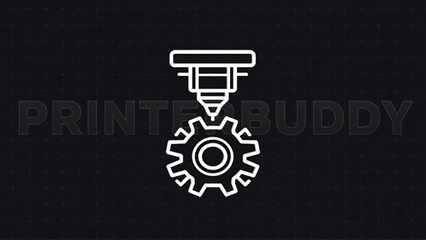

# PrintBuddy

[🇩🇪 Deutsche Version](README.de.md)

  

<h1 align="center">PrintBuddy</h1>

  
  

  
  

Stream Deck plugin for monitoring and controlling 3D printers (focused on Klipper/Moonraker).

**Current Version:** `0.9.1`

## Changelog (v0.9.1)

- Fixed Multitool Property Inspector IP field flickering by preventing repeated settings rewrites caused by reference-based array comparisons.
- Fixed extruder selection behavior in Lite and Pro by preserving selected order, labels and the four-tool limit with value-based normalization.
- Added regression coverage for Multitool selection persistence without touching Moonraker/HTTP network code paths.
- Preserved dynamic tool controls and active in-progress edits in the Property Inspector during settings synchronization.

## Changelog (v0.8.0)

- Reorganized the settings for Status, Status FX and MultiExtruder into clear tabs.
- Expanded Status FX gauges with display controls, temperature ranges, gauge colours and a separate colour for speed or flow above 100%.
- Gauge visibility can now be set separately for each selected data type.
- Improved gauge layouts so labels and values remain readable in the different gauge shapes.
- Fixed the empty Gauge Options tab and improved saving and restoring of Property Inspector settings.
- Added all new labels to the 12 supported languages.

## Changelog (v0.7.21)

- Theme-provided `valueFontSize` and `labelFontSize` values are now editable after theme selection in Property Inspectors.
- Manual font-size overrides now persist correctly for non-user themes across save/reopen/update cycles.
- Theme changes still apply recommended default text sizes once during selection.
- Hid the Button Style selector from Property Inspectors while preserving internal compatibility and Classic default behavior.

## Changelog (v0.7.7)

- Fixed preset-theme application across Classic, Neon Glow and Cyber buttons: non-user presets now reliably apply their own palette and text defaults.
- Replaced fragile `import.meta.glob` theme discovery with explicit static theme imports in `src/core/themes/theme-registry.ts` so Rollup always bundles all presets.
- Preserved `USER_THEME` behavior: custom Property Inspector values stay editable and continue to override only for the user theme.
- Validated with `npx tsc --noEmit`, `npm run build` and `npm run i18n:audit`; generated bundle contains distinct palette tokens for presets like Prusa/Klipper/Synthwave.

## Overview

- Multiple actions for status, FX/gauges, multi-tool monitoring, webcam and printer control
- Theme system with centralized presets
- Theme-specific text defaults (status/message)
- Runtime + Property Inspector localization across 12 active locales
- Generated Property Inspector catalogs sourced from the canonical TypeScript runtime locales
- Per-key `en_gb` fallback and automatic RTL/LTR direction handling for Arabic
- Automatic build metadata and DIN 5008 timestamp in all Property Inspector footers
- Rehydration of selected language flag icons in Property Inspectors

## Changelog (v0.7.5)

- Added Moonraker port `7125` fallback and localized diagnostics for missing ports and invalid responses.
- Added dynamic text auto-fit and intentional line wrapping for compact 144x144 Stream Deck keys.
- Centered localized missing-IP, offline and connection-error messages by aligning SVG baselines with the text layout engine.
- Centralized PrintBuddy Status rendering while preserving the established theme and button-style composition.

## Changelog (v0.6.7)

- Removed the Klingon locale and its flag asset completely.
- Centralized the 12 active locales and generated Property Inspector catalogs from the runtime locale sources.
- Added Arabic RTL support, strict locale/catalog auditing and complete translation-key parity.
- Replaced generic `index.ts` and `settings.ts` modules with descriptive, function-based filenames.

## Changelog (v0.6.4)

- Property Inspector i18n flag path and locale normalization fixes for all supported languages.
- Dynamic language dropdown registration and immediate DOM re-translation on locale switch.
- Comprehensive JS/TS JSDoc expansion and Markdown visual header integration.

## Changelog (v0.6.2)

- Repository documentation update and standardization across all Markdown files.

## Changelog (v0.6.1)

- Standardized dual-language documentation architecture across repository markdown files (EN/DE).
- Cleaned up public documentation and removed internal build validation log fragments.
- Synchronized project state and release versioning to `0.6.1`.

## Changelog (v0.6.0)

- **i18n Lazy Loading & Performance Boost:** Dynamic language loading significantly reduces plugin startup load.
- **ISO-Underscore Standardization:** Unified locale and flag naming scheme (`de_de`, `en_gb`, `fr_fr`, ...).
- **Build Metadata & PI Footer:** Automatic version and DIN 5008 timestamp (`YYYYMMDD.HHmm`) in all Property Inspectors.

## Development

#### Requirements
- Node.js
- npm

#### Development Environment
- OS: Windows 11
- Editor: Visual Studio Code v1.137.0
- Stream Deck Target: v7.5.1
- Tested Devices: Stream Deck MK.2, Stream Deck XL, Stream Deck Plus (v1)

#### Commands
- `npm run i18n:generate`
- `npm run i18n:audit`
- `npm run build`

## Third-Party Assets

- Icon attribution: `com.ulli.printbuddy.sdPlugin/licences/ICON_ATTRIBUTION.md`

## Full Release History

- For the complete version history, see [PATCHNOTES.md](PATCHNOTES.md).
